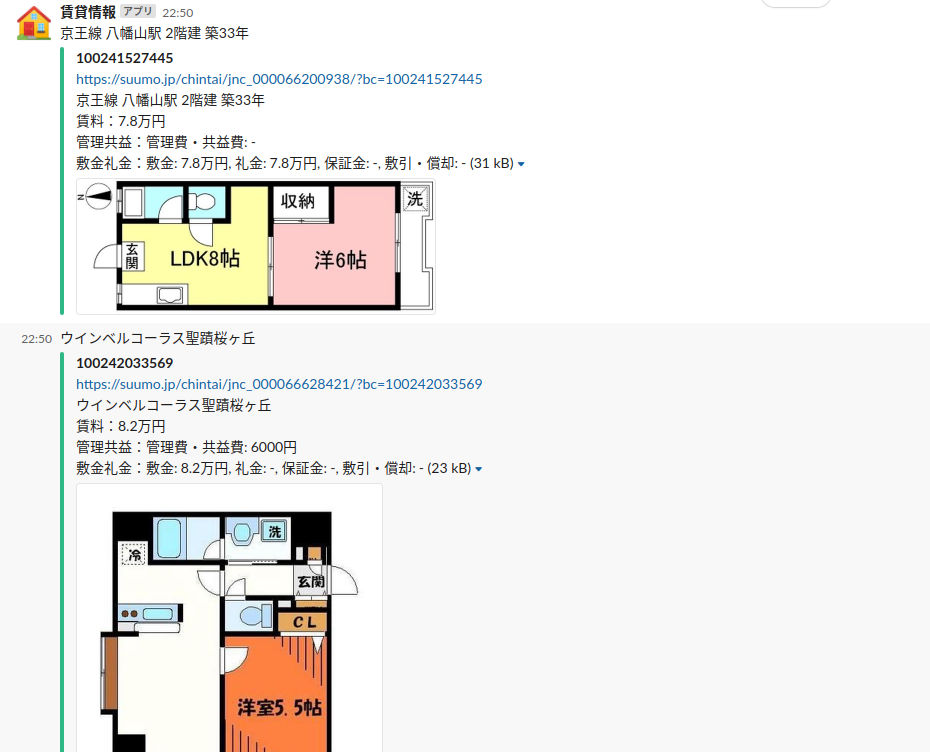
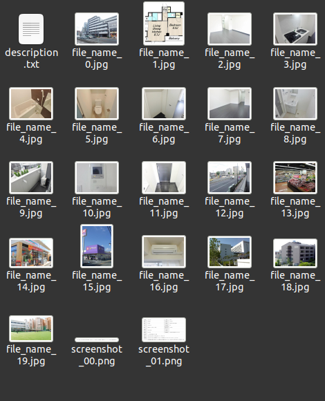
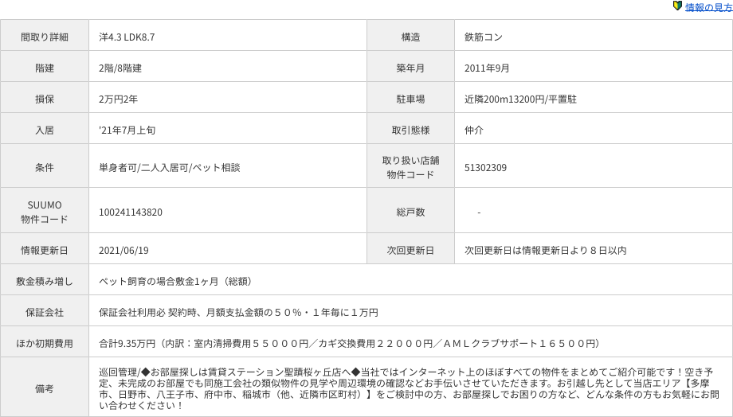

# suumo-crawler
scrape suumo information and make suumo db with mongo DB

## What is this?


slackへsuumoの情報を投稿できるよ



suumoのページは更新が激しいのでローカルに画像をおとせるよ



seleniumからhtml2canvas.jsを実行して賃貸情報を画像で取れるよ


## USAGE
一覧ページからスクレイピング
```
python main.py scrape
```

slackへ送信
```
python main.py slack 20210621
```

## ToDo
- 一覧ページの設定オプション
- 物件一件あたりでSlackへ投稿できるようにする
- slack upload.apiを使ってダウンロードしたローカルの画像でslack通知できるようにする(chat.apiの画像だと掲載期間終わったら消える可能性あるので）
- thread_tsを取得できるようにして一物件単位でスレ形式で投稿する
